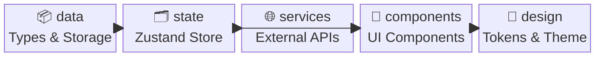
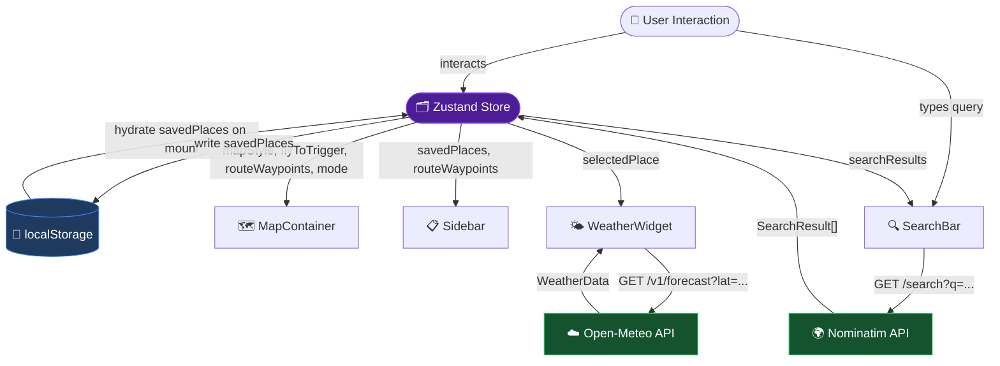

# Architecture Overview

Atlasify is a **client-side Next.js map application** with no dedicated backend. All state is managed in-browser; external data is fetched directly from third-party APIs.

---

## Modulith Structure

The application is organized as a **modulith** — a single Next.js app with clearly separated internal modules, each owning its own concern:

| Module       | Responsibility                                                   |
|--------------|------------------------------------------------------------------|
| `data`       | Type definitions and LocalStorage persistence schema             |
| `state`      | Global client state via Zustand                                  |
| `services`   | External API integrations (Geocoding, Weather)                   |
| `components` | UI rendering units (Map, Sidebar, SearchBar, WeatherWidget)      |
| `design`     | Design tokens, theme, and visual language                        |

---

## Tech Stack

| Concern          | Technology                          |
|------------------|-------------------------------------|
| Framework        | Next.js (App Router)                |
| Map Rendering    | `react-map-gl` + `maplibre-gl`      |
| State Management | `zustand`                           |
| Styling          | Tailwind CSS + custom CSS           |
| Geocoding        | OpenStreetMap Nominatim (REST)      |
| Weather          | Open-Meteo (REST)                   |
| Geospatial Utils | `@turf/turf`                        |
| Charts           | `recharts`                          |
| Icons            | `lucide-react`                      |
| Persistence      | `localStorage`                      |

---

## Data Flow

---

## Routing

Atlasify is a **single-page application**. All UI is rendered under the root route `/` via `app/page.tsx`. There are no additional pages or API routes.

---

## References

- [Data Models](../data/models.md)
- [State Management](../state/store.md)
- [External Services](../services/apis.md)
- [Component Specs](../components/components.md)
- [Design System](../design/theme.md)
