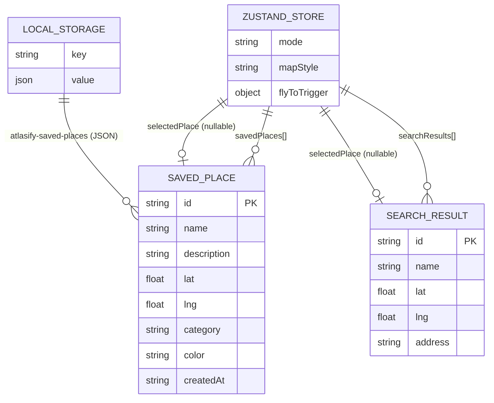

# Data Models & Types

All core TypeScript interfaces used across the application.

---

## SavedPlace (Bookmarks)

Represents a location saved by the user with metadata.

```typescript
interface SavedPlace {
  id: string;          // UUID v4
  name: string;        // User-defined title
  description: string; // Address or description
  lat: number;         // Latitude
  lng: number;         // Longitude
  category: "food" | "nature" | "work" | "cultural" | "other";
  color: string;       // Hex color for marker and analytics
  createdAt: string;   // ISO-8601 Timestamp
}
```

---

## SearchResult

Represents a place returned by the geocoding service.

```typescript
interface SearchResult {
  id: string;
  name: string;
  lat: number;
  lng: number;
  address: string;
}
```

---

## LocalStorage Schema

Saved places are persisted client-side:

| Key                      | Value                     |
|--------------------------|---------------------------|
| `atlasify-saved-places`  | JSON array of `SavedPlace` |

The store hydrates from localStorage on mount and writes back on every modification to `savedPlaces`.

---

## Entity Relationships


