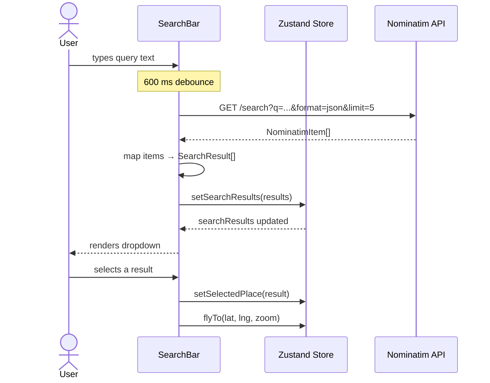
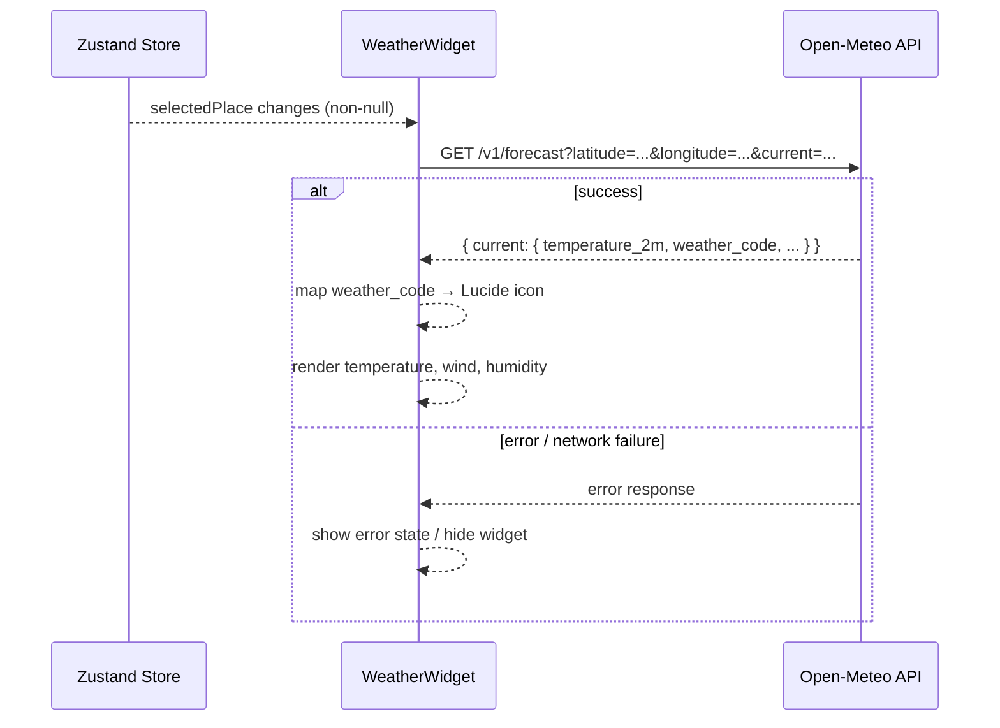
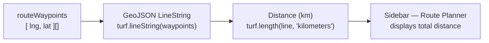

# External Service APIs

Atlasify integrates with two external REST APIs. Both are free and require no API key.

---

## Geocoding — OpenStreetMap Nominatim

Used by **SearchBar** for place autocomplete.

- **Base URL**: `https://nominatim.openstreetmap.org/search`
- **Method**: `GET`
- **Debounce**: Requests are throttled with a **600 ms** input debounce to avoid rate-limiting.

### Query Parameters

| Parameter       | Value              | Description                      |
|-----------------|--------------------|----------------------------------|
| `q`             | `string`           | Search query text from user input |
| `format`        | `json`             | Response format                  |
| `addressdetails`| `1`                | Include full address breakdown    |
| `limit`         | `5`                | Max results returned             |

### Request / Response Flow



### Response Mapping → `SearchResult`

```typescript
// Nominatim response item → SearchResult
{
  id:      item.place_id,
  name:    item.display_name,
  lat:     parseFloat(item.lat),
  lng:     parseFloat(item.lon),
  address: item.display_name,
}
```

---

## Weather — Open-Meteo

Used by **WeatherWidget** to display current conditions at `selectedPlace`.

- **Base URL**: `https://api.open-meteo.com/v1/forecast`
- **Method**: `GET`
- **Trigger**: Fires whenever `selectedPlace` changes to a non-null value.

### Query Parameters

| Parameter   | Value                                                                 |
|-------------|-----------------------------------------------------------------------|
| `latitude`  | `selectedPlace.lat`                                                   |
| `longitude` | `selectedPlace.lng`                                                   |
| `current`   | `temperature_2m,is_day,weather_code,wind_speed_10m,relative_humidity_2m` |

### Request / Response Flow



### Displayed Fields

| API Field              | UI Label       | Notes                                  |
|------------------------|----------------|----------------------------------------|
| `temperature_2m`       | Temperature    | Degrees Celsius                        |
| `weather_code`         | Condition icon | Mapped to Lucide icons                 |
| `wind_speed_10m`       | Wind Speed     | km/h                                   |
| `relative_humidity_2m` | Humidity       | Percentage                             |
| `is_day`               | Day/Night hint | Used for icon variant selection        |

---

## Internal Logic / Geospatial

| Utility            | Library     | Usage                                               |
|--------------------|-------------|-----------------------------------------------------|
| Route distance     | `@turf/turf` | `turf.length(line, { units: 'kilometers' })` — computes total route length from `routeWaypoints` |


