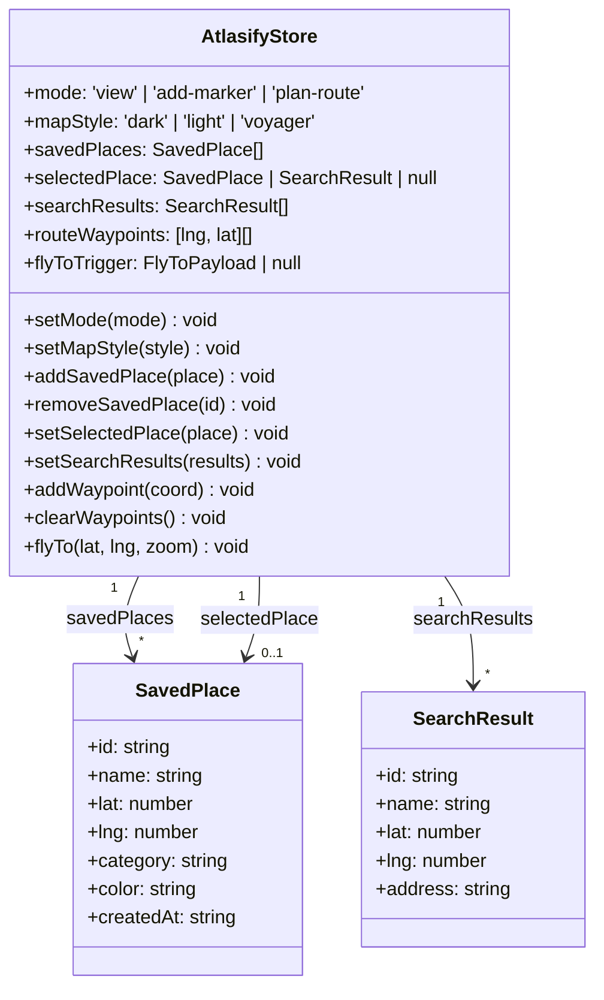
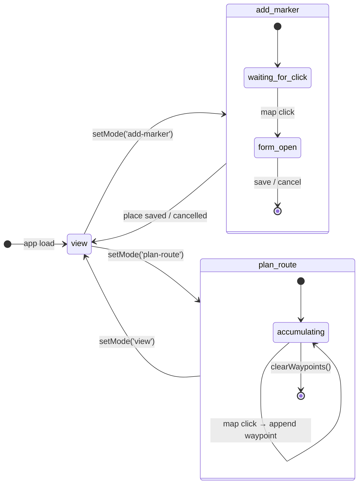

# State Management

Client-side global state is managed with **Zustand**. There is no server state; all data is local or fetched on demand.

---

## Store Variables

| Variable         | Type                                      | Description                                                      |
|------------------|-------------------------------------------|------------------------------------------------------------------|
| `mode`           | `'view' \| 'add-marker' \| 'plan-route'`  | Controls map interaction mode                                    |
| `mapStyle`       | `'dark' \| 'light' \| 'voyager'`          | Active tile stylesheet                                           |
| `savedPlaces`    | `SavedPlace[]`                            | User bookmarks — synced with `localStorage` on every write       |
| `selectedPlace`  | `SavedPlace \| SearchResult \| null`      | Active focused point on the map (from search or click)           |
| `searchResults`  | `SearchResult[]`                          | Autocomplete suggestions from Nominatim                          |
| `routeWaypoints` | `[lng, lat][]`                            | Ordered coordinate list used for route path plotting             |
| `flyToTrigger`   | `{ lat: number; lng: number; zoom: number } \| null` | Navigation command — consumed by MapContainer       |

---

## Persistence

- On mount, the store hydrates `savedPlaces` from `localStorage` key `atlasify-saved-places`.
- Any mutation to `savedPlaces` immediately writes the updated array back to `localStorage`.

---

## Mode Behavior

| Mode           | Map Behavior                                                        |
|----------------|---------------------------------------------------------------------|
| `view`         | Default — pan and zoom only                                         |
| `add-marker`   | Next map click opens the "Save Place" form at the clicked coordinate |
| `plan-route`   | Each map click appends a waypoint to `routeWaypoints`               |

---

## References

- Implementation: [`lib/store.ts`](../../lib/store.ts)
- Type definitions: [`data/models.md`](../data/models.md)
