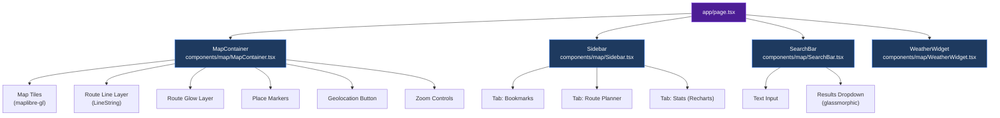
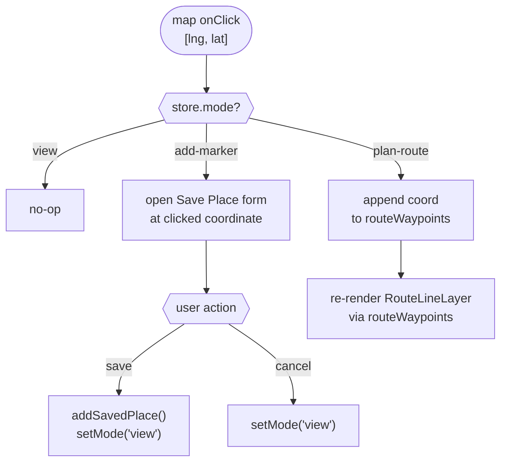
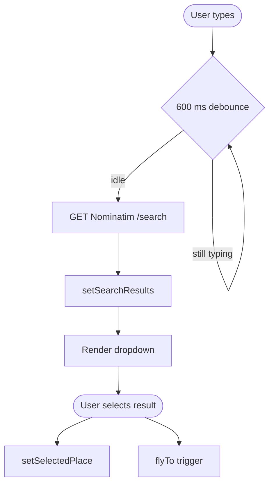

# Component Specifications

All UI components are React client components rendered under `app/page.tsx`.

## Component Hierarchy

---

## MapContainer

Renders the interactive map canvas.

- **Library**: `react-map-gl` + `maplibre-gl`
- **File**: `components/map/MapContainer.tsx`

### Tile Style URLs

| Theme   | URL                                                                         |
|---------|-----------------------------------------------------------------------------|
| Dark    | `https://basemaps.cartocdn.com/gl/dark-matter-gl-style/style.json`          |
| Light   | `https://basemaps.cartocdn.com/gl/positron-gl-style/style.json`             |
| Voyager | `https://basemaps.cartocdn.com/gl/voyager-gl-style/style.json`              |

Active URL is driven by `store.mapStyle`.

### Layers

| Layer           | Type       | Source              | Style                                                   |
|-----------------|------------|---------------------|---------------------------------------------------------|
| Route Line      | `LineString` | `routeWaypoints`  | `line-color: "#8b5cf6"`, `line-width: 5`                |
| Route Glow      | `LineString` | `routeWaypoints`  | Wide low-opacity line beneath route line for glow effect |

### Controls

- **Geolocation**: Custom button — locates the user via the browser Geolocation API, sets `selectedPlace`, and triggers `flyToTrigger`.
- **Zoom**: Custom `+` / `−` overlay buttons.

### Events

- **onClick** (map): Behavior depends on `store.mode`:
  - `add-marker` → opens Save Place form at clicked `[lng, lat]`
  - `plan-route` → appends coordinate to `routeWaypoints`
  - `view` → no-op

---

## SearchBar

Floating geocoding input widget.

- **File**: `components/map/SearchBar.tsx`
- **Position**: Floating overlay, top of map
- **Service**: Nominatim (see [services/apis.md](../services/apis.md))
- **Debounce**: 600 ms

### Behavior

1. User types in the input field.
2. After 600 ms of inactivity, a Nominatim request is fired.
3. Results populate `store.searchResults` and render in a dropdown.
4. Selecting a result sets `store.selectedPlace` and fires `store.flyToTrigger`.

### Visuals

- **Dropdown**: Glassmorphic panel with hover highlights per result item.

---

## WeatherWidget

Floating widget showing current weather at the active location.

- **File**: `components/map/WeatherWidget.tsx`
- **Position**: Floating overlay, bottom-left or top-right of map
- **Trigger**: Renders when `store.selectedPlace` is non-null

### Displayed Data

| Field           | Source Field              |
|-----------------|---------------------------|
| Temperature     | `current.temperature_2m`  |
| Condition icon  | `current.weather_code` → Lucide icon mapping |
| Wind Speed      | `current.wind_speed_10m`  |
| Humidity        | `current.relative_humidity_2m` |

---

## Sidebar

Collapsible panel with three tabs.

- **File**: `components/map/Sidebar.tsx`
- **Position**: Left overlay on top of map

### Tab 1 — Bookmarks

- Filter saved places by `category`
- Delete individual bookmarks
- Save a new place from a clicked coordinate (opens inline form)

### Tab 2 — Route Planner

- Lists all `routeWaypoints` in order
- Displays total route distance via `turf.length(line, { units: 'kilometers' })`
- Allows removing individual waypoints

### Tab 3 — Stats

- Groups `savedPlaces` by `category`
- Renders a bar chart per category count using **Recharts**
