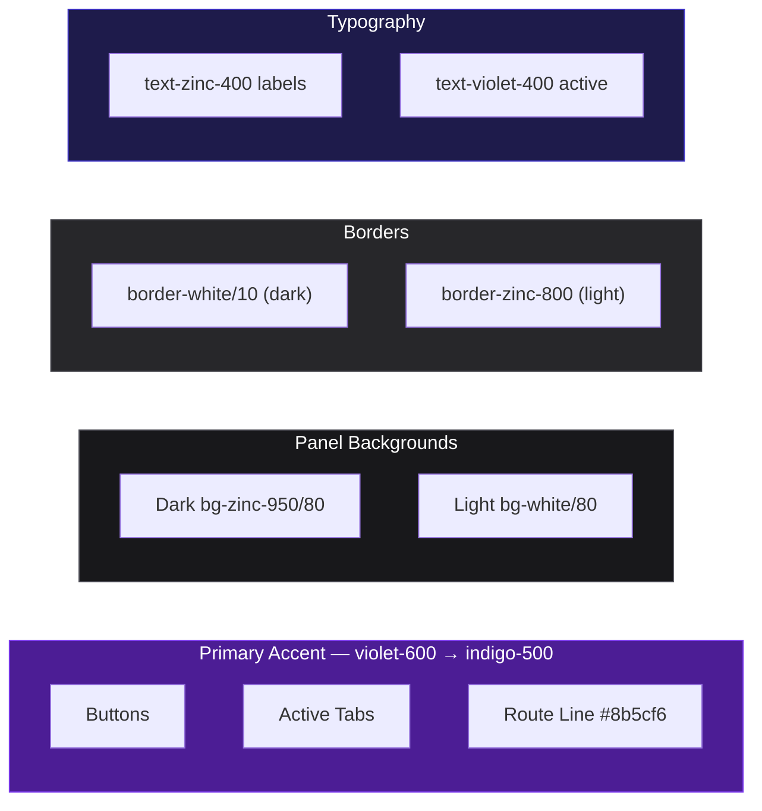
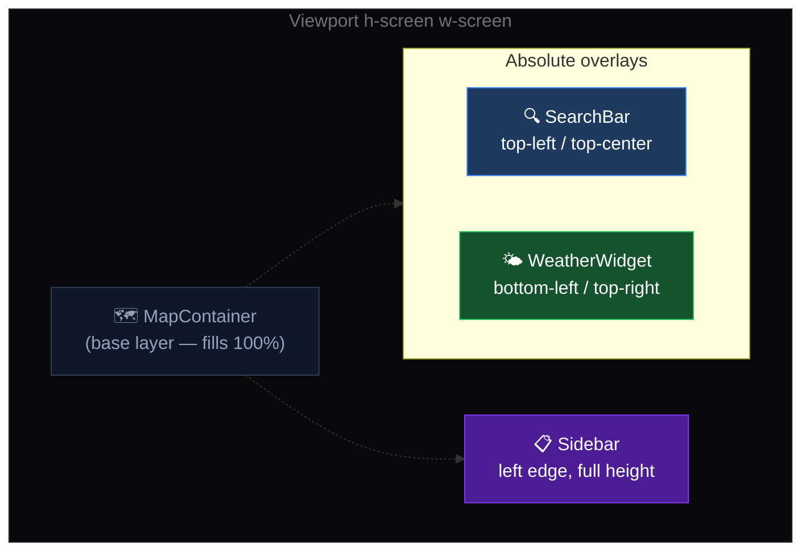

# Design System & Theme

---

## Color Palette

| Role            | Value / Class                                   | Usage                                       |
|-----------------|-------------------------------------------------|---------------------------------------------|
| Primary Accent  | `violet-600 → indigo-500` gradient              | Buttons, active tabs, route line color      |
| Route Line      | `#8b5cf6` (violet-500)                          | Map route `LineString` layer                |
| Background (dark) | `bg-zinc-950/80`                              | Glassmorphic panel base in dark mode        |
| Background (light)| `bg-white/80`                                 | Glassmorphic panel base in light mode       |
| Border          | `border border-white/10` or `border-zinc-800`   | Subtle panel borders                        |



---

## Glassmorphism

All floating panels (Sidebar, SearchBar dropdown, WeatherWidget) use a consistent frosted-glass treatment:

```css
/* Glassmorphic panel */
backdrop-filter: blur(24px);          /* backdrop-blur-xl */
background: rgba(9, 9, 11, 0.80);    /* bg-zinc-950/80 in dark mode */
border: 1px solid rgba(255,255,255,0.08);
border-radius: 1rem;
```

Light mode swaps `bg-zinc-950/80` → `bg-white/80`.

---

## Typography

| Element       | Class / Style               |
|---------------|-----------------------------|
| Body          | System font stack (Next.js default) |
| UI Labels     | `text-sm`, `text-zinc-400`  |
| Headings      | `text-base font-semibold`   |
| Active/accent | `text-violet-400`           |

---

## Layout

- **Root**: `h-screen w-screen overflow-hidden` — full-viewport, no scroll
- **Map**: Fills the entire viewport as the base layer
- **Panels**: Positioned absolutely over the map (`position: absolute` / Tailwind `absolute`)
  - Sidebar: left edge, full height
  - SearchBar: top-center or top-left
  - WeatherWidget: bottom-left or top-right



## Map Themes

The map itself has three visual themes controlled by `store.mapStyle`:

| Value     | Tile Style   | Feel                     |
|-----------|--------------|--------------------------|
| `dark`    | Dark Matter  | Nighttime / high-contrast |
| `light`   | Positron     | Clean / minimal           |
| `voyager` | Voyager      | Outdoor / topographic     |

---

## Interactive States

| Element         | Default          | Hover / Active                          |
|-----------------|------------------|-----------------------------------------|
| Sidebar tab     | `text-zinc-400`  | Gradient underline, `text-violet-400`   |
| Bookmark card   | Subtle border    | Slight background lift                  |
| Button (primary)| Violet-indigo gradient | Brightness increase on hover       |
| Search result   | Transparent      | `bg-white/10` highlight                 |
